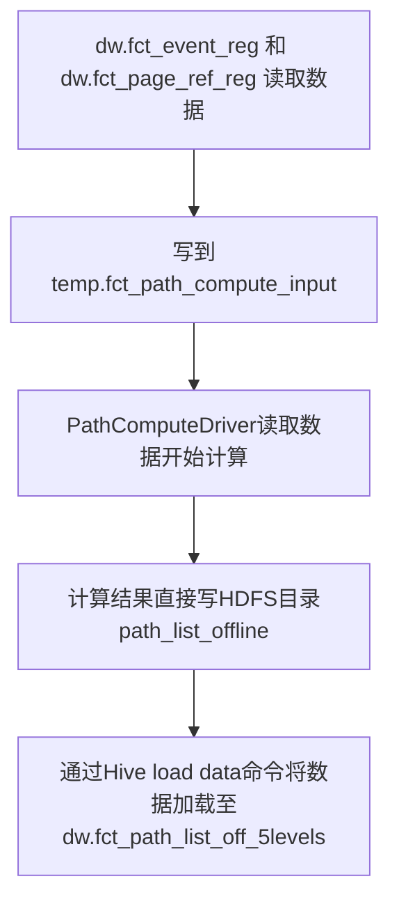

User Access Path 用户访问路径模型
=======

## 用户访问路径分析

[流程](https://mermaidjs.github.io/mermaid-live-editor/#/edit/eyJjb2RlIjoiZ3JhcGggVEQ7XG5BW2R3LmZjdF9ldmVudF9yZWcg5ZKMIGR3LmZjdF9wYWdlX3JlZl9yZWcg6K-75Y-W5pWw5o2uXS0tPkJb5YaZ5YiwdGVtcC5mY3RfcGF0aF9jb21wdXRlX2lucHV0XTtcbkItLT5DW1BhdGhDb21wdXRlRHJpdmVy6K-75Y-W5pWw5o2u5byA5aeL6K6h566XXTtcbkMtLT5EW-iuoeeul-e7k-aenOebtOaOpeWGmUhERlPnm67lvZVwYXRoX2xpc3Rfb2ZmbGluZV07XG5ELS0-RVvpgJrov4dIaXZlIGxvYWQgZGF0YeWRveS7pOWwhuaVsOaNruWKoOi9veiHs2R3LmZjdF9wYXRoX2xpc3Rfb2ZmXzVsZXZlbHNdO1xuIiwibWVybWFpZCI6eyJ0aGVtZSI6ImRlZmF1bHQifX0)

对应的作业id是：2960

运行脚本：pathlist/docs/PathCompute/fct_path_list_off_5levels.sh

主类：com.imeijia.bi.path.PathComputeDriver

数据来源：数据是从dw.fct_event_reg 和 dw.fct_page_ref_reg 查询出来写到 temp.fct_path_compute_input 表中。按天分区存放。
详细逻辑见：pathlist/docs/PathCompute/merge_page_event.sql

默认参数：

日   期 | 读取数据的目录 | 数据输出目录 | 数据并行度
------|---|-----------|------------|----------
系统取前一天的日期 | /user/hive/warehouse/temp.db/fct_path_compute_input | /user/hadoop/dw_realtime/test/path_list_offline | 4

- input文件格式：text
- output文件格式：orc

## Apache ORC

